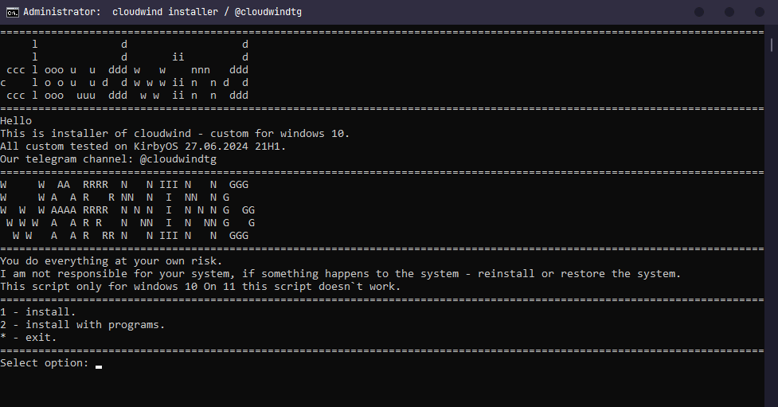

<h1 align="center">Hello windows, i`m cloudwind.</h1>

## WARNING!
You do everything at your own risk. 
I am not responsible for your system, if something happens to the system - reinstall or restore the system.
This script only for windows 10! On Windows 11 this script doesn`t work.



## How to install a cloudwind?
```
1. Go to releases
2. Download a archive
3. Unzip him & start cloudwind setup.bat.
```

## Windows version supported:
```
Windows 10, 21H2
Windows 10, 22H2
```
## Some information


1               | 2
---             | ---
OS              | [Windows 10, KirbyOS 21H1](https://discord.gg/KirbyCS)
Theme           | [Catppuccin](https://github.com/catppuccin/catppuccin)
Fonts           | [Jetbrains Mono Regular](https://www.jetbrains.com/lp/mono/)
Text redactor   | [N++](https://notepad-plus-plus.org/)
Videoplayer     | [VLC](https://www.videolan.org/)
Browser         | [Ungoogled Chromium](https://github.com/ungoogled-software/ungoogled-chromium)
